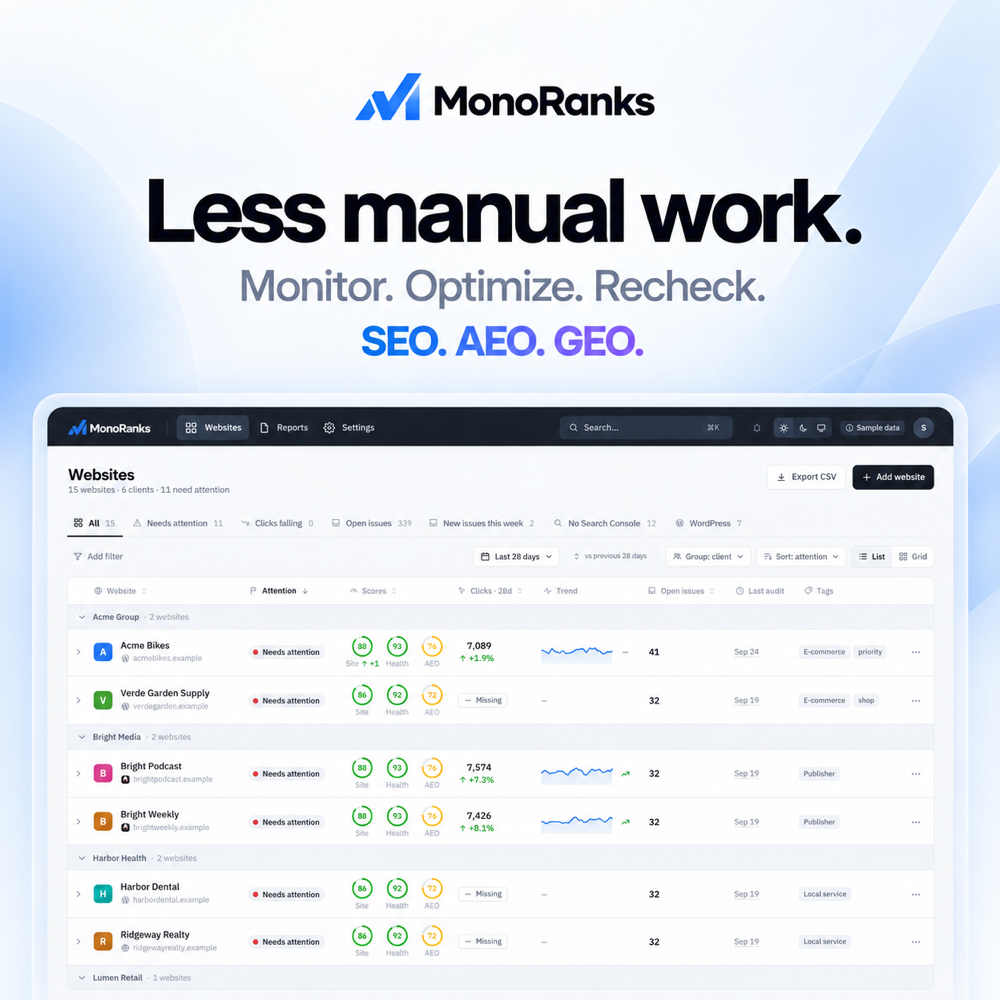

# MonoRanks for WordPress

**Find what holds your site back in search and AI answers, and fix it from one place.**

[MonoRanks](https://monoranks.com) checks your website every week for SEO (Google), AEO (answer engines) and GEO (AI search like ChatGPT and Perplexity). It explains each problem in plain words and suggests the fix. This plugin connects your WordPress site, so the fixes you approve are written for you, and each one can be undone.

[Install from WordPress.org](https://wordpress.org/plugins/monoranks/) · [Setup guide](https://monoranks.com/docs/wordpress-plugin/) · [Create a free account](https://app.monoranks.com)

## What it does

- **Fixes for you.** Titles, meta descriptions, image alt text, canonical and noindex, redirects, a short answer-first opening for key pages, and rules for AI crawlers. You approve each one first.
- **Undo any change.** Every change is listed under **MonoRanks → Settings** and can be undone.
- **Results inside WordPress.** A MonoRanks menu shows your site's scores, search clicks, pages that need attention and fixes ready to apply. Posts and Pages get a column with each page's scores.
- **Works with your SEO plugin.** Yoast SEO, Rank Math, All in One SEO and The SEO Framework keep working as before; MonoRanks writes into their fields. With another SEO plugin, MonoRanks does not write titles, descriptions, canonicals or noindex, and says why.
- **Sends only what is needed.** Published page details such as titles and descriptions, so checks stay up to date. Never drafts, comments or passwords.

## Get started

1. In WordPress, go to **Plugins → Add Plugin**, search for **MonoRanks**, click **Install Now**, then **Activate**.
2. In [MonoRanks](https://app.monoranks.com), open your website, go to **Integrations → WordPress** and click **Connect to WordPress**.
3. Approve the connection when WordPress asks. That's it.

To stop at any time: **MonoRanks → Settings → Disconnect**.

## For developers

Build, tests and releases are described in [docs/development.md](docs/development.md). The plugin's API use is in [docs/api.md](docs/api.md).

License: GPL-2.0-or-later.
